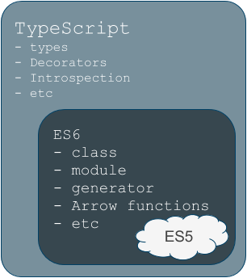

> __disclaimer:__ это не туториал, это не учебник по TypeScript, это что-то другое. Этой заметке я во многом капитанствую и пишу для кого-то очевидные вещи. В заметке вы наверняка найдет грамматические ошибки, не стесняйтесь исправлять и предлагать исправления. 
> 
> А еще, я не могу на 100% исключать вероятность, что я что-то не правильно понял и потому ввожу вас в заблуждение -- за разъяснения и исправления таких ошибок я буду особенно благодарен.
 
# TypeScript как будущее энтерпрайзного JavaScript 

# Intro

Не стану пересказывать тут историю появления JS, она прекрасно всем известна и описывается одним словом -- спешка. 

JavaScript задумывался и создавался в очень сжатые сроки, по словам Brendan Eich (создатель языка JavaScript), у них было лишь 10 дней на все. Microsoft наступало на пятки и если бы они проиграли, то сейчас эта статья была бы частично
про VBScript (Visual Basic Script).

# Бой с ветряными мельницами

Браузерный мир выбрал JavaScript со всем его недостатками, оговорками и поверхностной простотой. С тех пор утекло много воды, сам язык изменился, оброс дополнениями и удобствами, но основные проблемы остались, избавиться от них почти не реально не сломав весь интернет.

Первые веб-сайты были очень просты и статичны. JavaScript использовался лишь в редких случаях для анимации или валидации форм перед отправкой. Проблема заключалась в том, что далеко не все браузеры в принципе поддерживали JavaScript. 

Когда же он стал стандартом для всех популярных браузером, началась разработка и приложений которые делали в рамках веб-страницы нечто большее, чем анимация бегущей строки или проверки введенных значений на форме обратной связи. приложения становились больше и начали давать о себе знать проблемы JavaScript связанные с типами данных, с отсутствием единого способа наследования объектов, с моделью памяти JS и многое другое.

Сам язык способствует и прощает написание плохого кода. Динамическая природа языка просто подталкивает к написанию универсальных функций которые могут принимать десятки вариантов аргументов (как по типу данных, так и по их количеству).

> Рискую быть закиданным помидорами, т.к. покушаюсь на святое, но самый популярный пример -- [jQuery](http://jquery.com/).
> 
> Стоит хотя бы вспомнить возможные варианты главной функции-объекта jQuery... "Функция-объект" -- чувствуете как это звучит? 
> 
> jQuery -- сегодня, вы можете вызвать jQuery как функцию, девятью (Девятью, Карл!) различными способами (все зависит от аргументов). А еще, сама функция является объектом в котором может быть неконтролируемое число методов и/или свойств. Да, jQuery это действительно швейцарский нож с огромным количеством возможностей по упрощению жизни рядовому веб-разработчику. Но часто, на базе системы jQuery-плагинов создают целые приложения интернет-магазина с десятками форм и диалогов. И вот там уже начинается натуральный ад и "лапша-код". Это самый популярный пример. jQuery разрабатывался как средство удобного доступа к DOM, но в итоге получился комбайн и практически отдельный язык программирования и порождает целую отдельную вселенную безумия где на каждый вопрос один ответ -- плагин для jQuery 


Да, написано огромное количество фреймверков уровня приложения, которые помогают удержать всею мощь динамичной лапши в узких рамках предложенной/рекомендуемой/требуемой структуры файлов и папок. Только благодаря таким фреймверкам мы с вами еще не сошли с ума окончательно.

> Для повествования, давайте создавать формулу разработки хорошего front-end приложения. Хорошего не в плане коммерческого успеха, это явно выход за рамки этой заметки; хорошего, в плане кода, его организации, удобства поддержки. Представим, что перед нами стоит задача разработки действительно большого и сложного браузерного приложения, скажем... на пару-тройку миллионов строк для первой беты. Как вам, достаточно круто?

В корпорациях вроде Google, технические специалисты очень быстро столкнулись с тем, что с ростом размеров JavaScript приложения практически с геометрической или даже экспоненциальной скоростью растёт и стоимость/затраты на поддержку и исправление ошибок. Ответом на эту проблему Google выпустил GWT -- Google Web Toolkit. Это компилятор, набор инструментов и базовых классов для работки веб-приложений на Java. Стало возможным с минимальными оговорками писать веб-приложения на строго типизированном языке программирования с использованием большинства его плюшек. В качестве результата вы получаете приложение написанное на, фактически, машинном JavaScript. Этот код невозможно отлаживать отдельно от GWT, это просто лишено смысла. В декабре прошлого года, после более чем года молчания проект выпустил бету новой версии (2.8.0). Стоит так же заметить, что GWT чаще рассматривают как единственную возможность для джавистов не владеющих JS писать развесистый front-end без отрыва от любимого языка для back-end'а.

Других же, не устраивал только синтаксис JavaScript и они разрабатывали свои варианты языка программирования, которые с разной степень прозрачности транслируются в JavaScript. Тут список примеров возглавляет, конечно же [CoffeScript](http://coffeescript.org/).

Подборка всего, что так или иначе транслируется в JavaScript опубликована [на github в wiki](https://github.com/jashkenas/coffeescript/wiki/List-of-languages-that-compile-to-JS) одного из ярких представителей семейства -- CoffeScript.

> Общий смысл сводит к тому, что вы можете писать front-end приложение почти на любом языке программирования который вам нравится, важно лишь, что бы была возможность сгенерировать JavaScript код на базе вашего исходного кода.

# ES6 

ES6 приходит к нам как набор дополнений к уже привычному стандарту ES5. Набор этих дополнений не точен, постоянно дополняется и переделывается в той или иной степени. 

Конечно, ввиду того, что браузеров больше чем один и интерпретаторов JS, как минимум, столько же (даже не смотря на общие корни и/или основу у многих из них), каждый из них гнет свою линию и экспериментирует с синтаксисом, с трактованием предложений сообщества или предлагает свои идеи. 

Это своего рода продолжение войны браузеров, но уже в более вялой форме. Вот только она по прежнему приводит к условиям проверки браузера или даже его версии в нашем коде, всевозможным "полифилам" (`polifill`) которые мы вынуждены подключать к нашим проектам, если хотим использовать какую-то "вкусность" из ES6, например `Promise` или `setImmediate`. Но это история про браузерный API, а не про сам язык JavaScript.

Если же мы хотим использовать чуть более классические (в сравнении с другими языками) классы, генераторы, не хотим думать о контексте для колбека, то тут уже начинаются проблемы - одно дело, желания современного разработчика которых хочет писать современный код и совсем другое дело, реальность брузеров клиентов. Вот тут на помощь и приходят транспайлеры и компиляторы.

## Babel -- ES6 сегодня в каждый браузер

Проект [Babel](https://babeljs.io/) представляет из себя транспайлер из современного представления о правильном ES6 или даже ES2015 в код совместимый с ES5. Т.е. разработчик получает возможность писать на самой современной версии JavaScript и в большинстве случаев не беспокоится о совместимости с браузерами, которые еще не включают поддержку ES6 в свои JS-движки (ну или не включают по умолчанию, т.к. все что скрыто за специальными экспериментальными настройка, лучше считать выключенным и недоступным). Про проект и все его возможности вы можете прочитать на официальном сайте, а мы же пойдем дальше.

# Бардак и порядок

Хорошо, мы можем сказать, что мы можем прозрачно использовать все вкусности современного JavaScript в своем коде и не беспокоится о совместимости с браузером.

> Введем дополнительный коэффициент в нашу ситуацию -- наше большое приложение мы пишем не в одиночку и долгие годы, а командой программистов разной квалификации, скажем в 20 человек и время у нас ограничено бюджетом или уже утвержденной датой релиза, не суть важно.

Когда команда разработки имеет более одного человека в составе, уже нужны соглашения. Соглашения по архитектуре, выборе внешних библиотек, фреймверка или списка фреймверков (мало ли?). Большинство из этих вопросов решается устно за пару митингов и уточнятся устно (конечно же документируется, верно?) на последующих митингах. 

С началом разработки появляются новые вопросы и трудности - иерархии классов нужно поддерживать здоровыми и четкими. Минимализм интерфейсов крупных компонентов нужно строго документировать и постоянно устраивать внимательное ревью кода, что бы не пропустить момент, когда все пойдет вкривь и вкось. А это обязательно случится. В какой-то команде/проекте раньше, в какой-то позже, но это случится. И это будет похоже на притчу про лягушку в кастрюле с холодной водой на медленном огне. В чем может быть причина такого развития событий?

Тут я выскажу исключительно свое мнение, которое вы не должны воспринимать как чистую правду или аксиому. Но дело вот в чем: динамическая природа JS подталкивает к излишней гибкости и это расхлябывает интерфейсы объектов и функций. Со временем, ваши функции и конструкторы объектов начинают принимать все больше разновидностей аргументов, объектов разной степени целостности и такая гибкость в итоге приводит к росту числа фантомных багов, которые решаются подпорками то тут то там, что в свою очередь, еще сильнее повышает энтропию в вашем коде. Единственное спасение от такого сценария -- постоянное жестокое ревью каждого коммита/пул-реквеста, где каждое расширение интерфейса ставится под сомнение и отвергается, если задачу возможно решить уже существующими средствами, ну и постоянный рефакторинг и борьба с техническим долгом. Да, это противоречит большинству идей, что "Сначала доставить клиенту продукт, потом наведем порядок" и "Ну ведь работает же?", это все понятно, но крайности -- это всегда плохо, нужно искать баланс, когда вы сможете и продукт доставить вовремя и не превратите процесс разработки и поддержки в ад ну или хотя бы отсрочите коллапс лапша-кода на максимальное время. Согласно второму закону термодинамики, энтропия возрастает, но в наших силах хотя бы замедлить этот процесс.

# TypeScript

Пришло время перейти к главной теме -- TypeScript. 

Язык программирования, супер-сет вокруг ES6, ES2015 разработанный Microsoft и теперь развивающийся в содружестве с комьюнити.



Что же предоставляет TypeScript:

* Любой JavaScript это валидный TypeScript
* Статическая типизация и выведение типов
* Необязательные аргументы для функций и значения по умолчанию
* public, private, protect для свойств и методов классов
* Геттеры и сеттеры для свойств "без головной боли"
* Декораторы для всего \*
* Интерфейсы и абстрактные классы
* Generics
* Компилирование в ES5 или даже в ES3 (с оговорками)

И в том числе плюшки ES6:

* Arrow Functions
* Классы с единым стилем наследования
* Итераторы и Генераторы *
* Многострочные строки с шаблонизацией и тоже "без головной боли" с плюсами и кавычками
* Управление зависимостями, в том числе и их динамическая загрузка

\**(цель компиляции - не ниже ES5) экспериментальная поддержка, имплементация может измениться*

## Без магии или Контроль над ситуацией

Главное что нужно усвоить при начале использования TypeScript, что никакой магии компилятор не делает и, что бронежилет он на вас тоже не надевает. Вы по прежнему можете писать низкокачественную лапшу и компилятор это переварит, хоть и завалит вам предупреждениями.

Подавляющее большинство работы по защите вас от вас же компилятор производит именно в момент компиляции на этапе анализа типов данных и их взаимодействия. Вообще вся история про TS так или иначе сводится к сверке типов данных и интерфейсов объектов. Только после этого начинают работать преобразователи синтаксического сахара, которые чем-то напоминают простые макросы, которые по шаблону переделывают строки (конечно, это грубое сравнение, но оно близко к реальности).

Компилятор не будет против сложения числа со строкой или даже объектом, он лишь выдаст предупреждение о том, что вы, объявляя тип имели скорее всего что-то другое, и вам стоит обратить внимание на конкретно эту строку и проверить, все ли вы тут делаете осознанно? Предупреждения -- главное оружие компилятора. Через предупреждения, которые он выдает в консоли, он сообщает вам о "сомнениях" относительно качества кода -- "Вы указали, что эта переменная имеет тип Строка, но вот тут вы используете её как Число, вы уверены?" (это очень вольный пересказ сообщения компилятора). Если вы уверены, ваш выбор конкретно такой логики осознан, то вы можете такую строчную переменную дополнить приведением типа к числу (или воспользоваться, например `parseInt()`) явно сообщая компилятору, что ситуация под контролем.

Весь генерируемый JS-код в результате работы компилятора может быть легко читаемым нормальным JS-кодом сохранившим имена переменных, объектов и свойств, ваши комментарии в нужных местах - все то, что даст вам легко сопоставить TypeScript-код с JavaScript-кодом для лучшего понимания языка. 

Это на самом деле удобно и практично, особенно в самом начале осваивания TS, его внедрения в существующий проект -- вы можете писать TypeScript-код и тут же видеть получаемый JavaScript-код. В большом JS-проекте, вы настраиваете компилятор просто компилировать `.ts` файлы в `.js` файлы рядом с оригиналом и это позволит не переделывать сборочные задачи в вашей системе сборки проекта. Конечно, для проектов которые с самого начала разрабатываются или полностью перешли на TypeScript очень удобно включить в настройках компилятора минификацию и объединение модулей одновременно с генерацией source map файлов. Но это будет потом. Давайте подробней рассмотрим что же предлагает TypeScrpt?

### Предупреждения и ошибки компиляции

В большинстве случаев, компилятор может скомпилировать код. Даже с предупреждениями. Возможных ошибок останавливающих компиляцию довольно мало, например, некоторые синтаксические конструкции, вроде декораторов, невозможно скомпилировать в код совместимый со стандартом ES3. Но это не означает что вы не можете настроить жесточайшие правила для своего проекта. 

Например, пакет компиляции TypeScript для `grunt` [grunt-ts](https://www.npmjs.com/package/grunt-ts) вы можете настроить так, что он будет обрывать сборку даже при одном предупреждении от компилятора.

Такое толерантное отношение к предупреждениям у компилятора связано в первую очередь с тем, что очень часто TypeScript-код работает вместе с обычным JavaScript-кодом и TypeScript-часть кода может не достаточно в полной мере описывать свою связь с JS-частью. Потому компилятор работает в условиях не полной картины мира и в предупреждениях сообщает как раз о таких острых для него краях этого мира. 

Лишь в ближайшее время компилятор TypeScript научится использовать в своей работе JavaScript-код (т.е. код в файла `.js`) это позволит расширить сферу его возможностей к анализу на jsDoc-комментарии, где часто можно встретить в том числе и типы данных для переменных и аргументов.

## Любой JavaScript это валидный TypeScript

Так как это супер-сет вокруг JavaScript, это означает, что вы можете использовать все что есть в JavaScript всех версий и то, что привносит непосредственно TypeScript. 

## Статическая типизация и выведение типов

У вас есть базовый набор типов JavaScript с явными декларациями, плюс парочка дополнительных, вроде `enum` (множество) и `tuple` (тьюплы, схожие по концепции с тьюплами в python)

Все типы данных, явно декларируемые для переменных и свойств классов, конечно же нужны только для проверок на этапе компиляции, никакой проверки типов на этапе выполнения не вносится. Все декларирование типов удаляется.

Компилятор достаточно умен, что бы не требовать повсеместного указания типов, значительную часть типов он способен вывести исходя из вашего кода. Местами это удобно и позволяет писать лаконичный компактный код. Но иногда, все же следует себя заставлять и явно описывать типы, повышая читаемость кода для других программистов, да и для вас "завтрашних". 

Например:

```javascript
function sum(a, b: number){
    return a + b;
}
```

В примере выше нет необходимости описывать возвращаемый функцией результат. Компилятору будет понятно, что сложение двух чисел всегда предполагает в результате число.

Но если волей программной логики, вы вынуждены реализовать функцию, чей результат по типу может быть очень разным (строка, логическое, объект, уж не знаю, как вам вообще такая идея пришла в голову, но да ладно) или размеры функции не позволяют окинув её взглядом понять какой тип данных она вернет, то его лучше указать явно, даже если компилятор вас об этом не просит (он смог вывести тип результата).

### Тип данных `Any`

TypeScript, как говорилось ранее, оставляет вам возможность использовать все богатства динамического языка и позволяет вам использовать особый тип данных `any`. Этот тип данных в TypeScript говорит компилятору буквально следующее: "В этой переменной может быть все что угодно, не обращай на неё внимание".

## Необязательные аргументы для функций и значения по умолчанию

Без предисловий, сразу пример, который расскажит сразу все.

```typescript
function F1(
    a, b: number, 
    c: {name: string}, 
    d: boolean, 
    ...otherParams: string[]): void { .. }

function F2(
    a, b?: number, 
    c?: {name: string} | number | string): void { .. }

function F3(
    a, b?: number, 
    C = 10): number { .. }
```

Кроме объявления типа или структуры (что по сути является типом, но без имени) аргумента, в `F1` используется конструкция для функции с неограниченным количеством аргументов (при вызове). Фокус состоит в том, что в переменную `otherParams` будут помещены все прочие (после четвертого) аргументы с которыми будет вызвана функция. Конечно, для этого будет сгенерированы несколько строк JS-кода, которые любезно отделят эти аргументы из `arguments` в массив.

`F2` описывает случай, когда в аргументах функции есть необязательные элементы - `<имяПеременной>?`. Это означает, что для этих параметров при вызове функции компилятор не будет напоминать в предупреждениях о не соответствии заголовка функции её вызову. Переменная `c` мало того, что не обязательная, так еще и описывает несколько вариантов своего типа. Т.е. эта переменная может быть универсальной по типу - компилятор проследит, чтобы только эти типы данных использовались при вызове функции с этим аргументом.

`F3` показывает пример с аргументом, который имеет значение по умолчанию. Синтаксически, здесь все просто, с точки зрения генерируемого JS-кода, тоже - создается условие, проверяющее аргумент на существование, если аргумент не определен, ему присваивают это значение.

Как видите, все то, что раньше нам приходилось снова и снова повторять в своем JS коде, простейшие конструкции, но в которых иногда закрадывались досадные опечатки, теперь можно не писать. Синтаксический сахар TS помогает сделать код понятней и наглядней.

> Те из вас, кто знаком с языком python могут спросить, почему авторы не пошли дальше и не добавили передачу аргументов по имени? Примерно вот так: `let x = F3(a = 1, c = 3);`.
> 
> Я, конечно же, выскажу только свое мнение, я даже не знаю, обсуждалась ли такая идея среди разработчиков языка. Но у такой идеи есть явная проблемная сторона - реализовать такой синтаксис возможно через оборачивание всех аргументов в объект с последующим таким вызовом. Но тогда такие функции будут потеряны для внешнего кода написанного на JS. Хотя, конечно можно представить заглушку и на этот случай, но тогда генерируемый код станет существенно сложнее, да и будет сложнее сохранить прозрачность трансляции и увеличится риск коллизий в именах аргументов и полей в передаваемых структурах. Т.е. что если внешний JS код вызывает такую функцию и в первом аргументе передает объект в котором есть поля, чьи имена совпадают с именами аргументов функции? Вводить запрет на "первый сложный аргумент функции"? Это выглядит, как минимум, странно.

## public, private, protect для свойств и методов классов

Об этом пункте можно было бы рассказать в разделе "Без магии или Контроль над ситуацией". 

Конечно же, в объектной модели JavaScript, в прототипах объектов не существует понятие областей видимости. И TypeScript не добавляет её через хитрейшие сокрытия переменных в областях видимости. Все проще. Если конкретное поле или метод класса вы описали как `private`, но чуть позже пытаетесь обратится к нему из вне, то компилятор скажет вам про это. Но опять же, не смотря на предупреждение в консоли при компиляции, компилятор послушно сгенерирует обращение к этому полю объекта в JS-коде.

## Геттеры и сеттеры для свойств "без головной боли"

Тут все просто -- вы используете один синтаксис `get name(){}`, а TypeScript генерирует для вас `Object.defineProperty` способ определения таких свойств. При это вам доступен и вариант с [вычисляемыми именами таких свойств](https://developer.mozilla.org/en-US/docs/Web/JavaScript/Reference/Functions/get#Using_a_computed_property_name).

## Декораторы для всего

_Это экспериментальный функционал, доступный за флагом `--experimentalDecorators` и при компиляции в JS версии не ниже ES5_

Декораторы, это синтаксический сахар и паттерн одновременно. 

В ранних версиях TS предлагалось использовать аннотации, но от этого отказались в пользу декораторов.

__Краткое отступление - аннотации:__

Аннотации, это функционал "аннотирования". Другим словом, это пометки на сущности. Выглядело это примерно вот так:

```
function annotate(obj){...}
// TS
@annotate
class A {...}

// JS

function A(){};
A.__annotations = [annotate(A)];

// или
function A(){};
A.annotations = [annotate(A)];

```

Т.е. к объекту прикреплялось дополнительное свойство `__annotations` или `annotations` которые можно было использовать по своему усмотрению. Вы заметили это "`__annotations` или `annotations`"? В этом и нашлась проблема, различные имплементации допускали разные варианты, что вводило путаницу. Проблема усугублялась еще больше, если существовал внешний код, который мог использовать эти свойства, но не знал какой именно вариант нужно искать в объекте, в итоге, применение такого сгенерированного кода в модуле написанном на JS обрастало условиями проверок вида аннотирования.
 
__Декораторы__

Декораторы, в свою очередь "декорирует" объект, оборачивают собой сущность и, если нужно, подменяют её.

Суть проще продемонстрировать на простом примере. Представим класс который предоставляет доступ к некой админке и кратко выглядит вот так:

```typescript
class AdminPage {
  isAuth: boolean = false;
  isRoot: boolean = false;
    
  @guest( { ifauth_redirect_to: 'home' })
  public login(){..}

  @auth
  public fetch(order: string[]){..}

  @auth
  @rootUser
  public destroyUniverse(){..}
}
```

Декораторы в этом примере описывают уровни доступа текущего пользователя к конкретным методам класса.

* Метод `login` доступен гостю, иначе перенаправить на страницу `home`
* Метод `fetch` доступен только авторизованному пользователю
* Возможность вызвать конец света методом `destroyUniverse` дана только авторизованному пользователю с правами рут-пользователя.

Такой стиль класса и использования декораторов должен вызвать чувство дежавю как минимум у питонистов и джавистов.

Долго не задерживаясь, давайте посмотрим на имплементацию декоратора `guest`:

```typescript
function guest(options: {ifauth_redirect_to: string | boolean} = {ifauth_redirect_to: false}){
  return function(
    target: any, 
    methodName: string, 
    desc: PropertyDescriptor) { // 1
      let origin = target[methodName];
      target[methodName] = function(){ // 2
          console.log("login decorator");
          if (this.isAuth && options.ifauth_redirect_to){
            this.redirect(options.ifauth_redirect_to);
          } else {
             origin.apply(this, arguments);
          }
      } // 2
      return target;
    } // 1
}
```

Итак, функция декоратора должна вернуть функцию которая будет вызвана для объекта декорирования при создании объекта.

В случае декорирования метода класса, функция-результат работы генератора декоратора получит __прототип__ объекта, строчное имя метода и [описание метода если оно существует](https://developer.mozilla.org/en/docs/Web/JavaScript/Reference/Global_Objects/Object/getOwnPropertyDescriptor)

Как видно из кода, мы сохраняем оригинальный метод и заменяем его своим, в котором проверяем нужные поля экземпляра объекта и вызываем оригинальную функцию если нужно.

Возможность ответить на вопрос "Как применять декораторы в реальной практике и зачем они вам нужны? я оставлю вам. Эта концепция имеет очень мощную основу и может существенно повлиять на архитектуру вашего приложения. 

Повторюсь, этот функционал носит в компиляторе экспериментальный характер, хоть и есть подозрение, что он останется именно в этом виде как доступен сейчас, хотя бы потому, что в таком же виде он уже много лет существует в python.

## Интерфейсы и абстрактные классы

Ни интерфейсов, ни абстрактных классов в JavaScript нет и нет разумных аналогов их представления. Потому, здесь речь опять про синтаксический сахар.

Приведу сразу объемный пример с комментариями, где я постарался использовать почти все:

```typescript
interface C {  
    abc: boolean;  
}

interface D {  
    dd: number[];  
}

abstract class B { // компилятор "не позволит" создать экземпляр этого класса
    constructor( public name: string ){ ... }; // аргумент name в конструкторе описан так,
                                               // что бы автоматически было создано свойство name
                                               // с публичным уровнем доступа
    test(a, b) { 
        return a === b; // для это функции типы не нужны
    } 
    abstract length(a, b: string): number // класс потомок обязан имплементировать этот метод
                                          // или объявить его снова абстрактным (как и сам класс)
}

class A extends B implements C, D {
    static x: number = 5
    private abc = true
    public dd = [10, 11]
    constructor(){ 
        super(“A”); // компилятор будет настаивать, что бы в первой строке конструктора вызвали конструктор предка
        ...
    }
    length (a, b: string): number { // обещанная имплементация
        return (a + b).length;
    }
}
```

Использование интерфейсов в TypeScript откровенно привносит порядок в безумный мир динамического программирования на JavaScript. Конечно же, при компиляции от интерфейсов не остается и следа. Но пока ведется разработка, они помогают контролировать ситуацию избегая дублирования свойств и методов, поддерживая соглашения между различными частями системы, предоставляя возможность IDE строить адекватные предположения и подсказки.

Еще пример ([взятый из официальной документации](http://www.typescriptlang.org/docs/handbook/interfaces.html)): 

```typeScript
interface IShape { 
    color: string;
}

interface ISquare extends IShape { // интерфейсы наследуются простым объединением
    sideLength: number;
}

let square = <ISquare>{}; // создание переменной с пустым объектом, но с указанием его типа или типа структуры
square.color = "blue";
square.sideLength = 10;
square.a = 1; // вызовет предупреждение -- этого свойства нет ни в одном из интерфейсов.
```

В этом примере показан случай создание типа данных типа структуры без использования классов. Они не обязательны для таких случаев. Выгода от такого подхода в том, что вы явно просите компилятор помочь вам не ошибиться при работе с переменной. Конечно, на базе этих же описаний IDE сможет предложить вам достойный набор автодополнений и даже рефакторинг.

А теперь, интерфейс для функции ([взятый из официальной документации](http://www.typescriptlang.org/docs/handbook/interfaces.html)):

```typeScript
interface SearchFunc {
    (source: string, subString: string): boolean;
}

let mySearch: SearchFunc;

mySearch = function(source: string, subString: string) {
    let result = source.search(subString);
    return result != -1;
}

```

Зачем это нужно? Ну например, вы можете описать интерфейс требуемого колбека. Если вам в функцию попытаются передать функцию с другим интерфейсом, компилятор предупредит об это. 

В этом разделе я привел лишь малую часть возможностей и особенностей интерфейсов, настоятельно рекомендую прочесть [оригинальную статью в документации](http://www.typescriptlang.org/docs/handbook/interfaces.html), там еще много полезного.

## Generics

Очень не простой функционал, хоть в базовом случае и работает очень просто. Пример из документации: 

```typescript
class GenericNumber<T> {
    zeroValue: T;
    add: (x: T, y: T) => T;
}

let myGenericNumber = new GenericNumber<number>();

myGenericNumber.zeroValue = 0;
myGenericNumber.add = function(x, y) { 
    return x + y; 
};
```

Как и в случае с интерфейсами лучше прочесть [главу в документации](http://www.typescriptlang.org/docs/handbook/generics.html) для полного понимания. Если кратко для статьи: компилятор подменяет `T` в декларации класса на `number` и перезапускает анализ будто у класса там везде `number`. Вот и все. Опять же, до JavaScript-кода вся эта магия (как же я старался избегать этого слова) не доходит, все проверяется/сверяется/выводится до трансляции в JS-код.

## Компилирование в ES5 или даже в ES3 (с оговорками)

Тут все просто, компилятор имеет внутри себя заготовки различных конструкции, вроде наследования, в виде шаблонов или кусков синтаксического дерева, это не важно, для различных версий стандарта EcmaScript (из списка поддерживаемых).

Оговорки касаются экспериментальных конструкций вроде декораторов и того, что просто не возможно описать в конкретной версии EcmaScript. Например, ни декораторы, ни `set/get` для полей класса, нельзя описать в стандарте ES3 -- просто в этом стандарте нет нужных вызовов в API примитива `Object`.

Выбор цели компиляции, гарантии, что будут доступны в качестве цели и будущие версии EcmaScript, делает TypeScript чуть ли не серебряной пулей -- вы уже можете использовать все то, что придумано нового в синтаксисе JavaScript, использовать проверку типов, декларации интерфейсов, абстрактные классы, декораторы и т.д. и в момент, когда бизнес решит, что браузеры клиентов уже готовы для ES6 или ES7, вы просто переключите компилятор на другую цель и генерируемый код обретет новые конструкции избавится от каких-то подпорок для обратной совместимости, потенциально даже может стать быстрее, т.к. вместо явных обходных путей будет использовать нативное API движка JS.

## ES6 в TypeScript

Как было сказано в самом начале, TypeScript является супер-сетом вокруг JavaScript. Это значит что он включает в себя все синтаксические конструкции, которые добавлены в JS в ES6. Я не вижу смысла освещать их здесь, это заметка все же про TypeScript.

# Новый проект на TypeScript -- с чего начать?

Весь потенциал TypeScript можно раскрыть если весь код проекта будет написан на TypeScript. Если это возможно, то у вас появляется шанс писать код который будет самодокументриуемым, с четкими контрактами интерфейсов. 

## Установка 

Все начинается через пакетный менеджер `npm`. В минимальном случае, вам нужны:

1. `typescript` - компилятор языка
2. `typings` - менеджер пакетов с декларациями типов и классов для внешних библиотек (о нем чуть позже)

Итак, ставим в системные npm-пакеты компилятор и менеджер деклараций для внешних библиотек, затем инициализируем файл с настройками компилятора:

```
$ npm install -g typescript typings
$ tsc --init
message TS6071: Successfully created a tsconfig.json file.
```

Посмотрим, что же вышло? В папке появился 1 новый файл `tsconfig.json` -- это файл настроек компилятора.

```
$ cat tsconfig.json 
{
    "compilerOptions": {
        "module": "commonjs",
        "target": "es3",
        "noImplicitAny": false,
        "outDir": "built",
        "rootDir": ".",
        "sourceMap": false
    },
    "exclude": [
        "node_modules"
    ]
}
```

Это конфигурация по умолчанию. Я пройдусь лишь по ней, полный перечень возможных настроек в виде аргументов для командной строки можно найти [здесь](https://github.com/Microsoft/TypeScript-Handbook/blob/master/pages/Compiler%20Options.md). Возможно, для вас не составит труда разобрать [JSON schema](http://json.schemastore.org/tsconfig) формата этого файла.

Я кратко опишу отдельные настройки.

## `module`

TS родился и развивается не в вакууме, даже несмотря на то, что это продукт Microsoft. Авторы языка знают о том, что JS готовят по разному.

* Что для серверного применения, загрузка внешних зависимостей происходит синхронно -- `commonjs`;
* В браузерных решениях могут применять [RequireJS](http://requirejs.org/) -- `amd`;
* `umd`, `system`, `es6`, `es2015` для более современных условий (или с применением соответствующих полифилов)

Для всех этих видов модулей, компилятор генерирует соответствующий код.

Т.е. в своем коде, вы используете:

```typescript
// de.ts
import { A, B, C } from 'classes/abc';

export class D {};

class E {};

export default E;
```

А в другом модуле 

```typescript
// x.ts
import XX from "classes/de";
import { D as deD } from "classes/de";
```

Весь этот синтаксис будет транслирован в нужный формат. Для AMD (RequireJS) появятся `define()` и будут объявлены нужные зависимости.

### AMD-модули

Один из самых не стандартных вариантов, это AMD-модульность от RequireJS. Уж не знаю почему, но RequireJS, по моему мнению, проиграл и скоро будет забыт. Зря, но его не используют.

Но т.к. все же остались большие проекты, которые просто не могут позволить себе жить без менеджера зависимостей, то следует рассказать о тонкостях AMD в мире TS, все же, до многого приходилось доходить чуть ли не через раскапывание исходного кода компилятора, что, конечно же, не делает чести официальной документации (к моменту написания заметки, документацию дополнили).

```typescript
///<reference path="../../../../typings/browser.d.ts" />
///<amd-dependency path="jQuery" name="$" />
///<amd-module name="specialName" />
import { IOptions, Modes } from 'classes/interfaces';
import { Toolbar } from 'classes/editor/toolbar/toolbar';
export class Something {
    public toolbar: Toolbar 
    constructor(options: IOptions){
        var x = new Modes();
        this.toolbar = null;
    }
}
```

Разберем пример почти построчно:
 
1. `///<reference path="../../../../typings/browser.d.ts" />` - Да, именно с тремя слешами. Разъясняет компилятору где искать декларации популярных внешних библиотек, что бы помогать нам автодополнениями и не ругаться о незнакомых функциях и объектах. Путь к этому файлу всегда задается относительным путем, я не нашел возможности решить это как-то более изящно;
2. `///<amd-dependency path="jQuery" name="$" />` - Явно говорит компилятору, что в зависимости модуля нужно добавить `jQuery` и в аргументах функции передать его как `$`. Компилятор не понимает структуру конфигурирования RequireJS, потому это способ объяснить компилятору "Доверься мне, у меня при помощи алиаса "jQuery" будет загружена нужная библиотек, просто добавь эту строку в зависимости и объяви её аргументом '$' ". Чуть ниже я приведу пример, что же будет сгенерировано.
3. `///<amd-module name="specialName" />` - не часто, но встречается случай, когда модулю нужно дать конкретное имя, а не просто путь к нему, для этого предназначена эта конструкция.
4. Следующие 2 строки импортируют 1 интерфейс и 2 класса. Да-да, я помню, что уже считается плохим тоном именовать интерфейсы с префиксом `I`, здесь это сделано для наглядности. Пути, которые используются, для импорта - это отдельная тема для разговора. Как сказано выше, компилятор не понимает конфигурации RequireJS и сам не содержит в себе настроек базового пути (по крайне мере в версии 1.8.0 этого еще нет). У меня работала без проблем такая конфигурация: RequirуJS был настроен на папку js (`basePath: "js/"`), с которой на одном уровне лежал конфиг компилятора, т.е. `classes/` на самом деле относительно `tsconfig.json` были `js/classes`, но компилятор отлично распознавал это.
5. `export class Something { .. }` - модуль должен что-то вернуть.

Обратите внимание на сам класс. В нем использованы оба интерфейса как типы и создается экземпляр класса.

А теперь посмотрим на результат генерации JS-кода:

```javascript
define("specialName", ["require", "exports", "jQuery", 'classes/interfaces'], 
function (require, exports, $, interfaces_1) {
    "use strict";
    var Something = (function () {
        function Something(options) {
            var x = new interfaces_1.Modes();
            this.toolbar = null;
        }
        return Something;
    }());
    exports.Something = Something;
});
```

Модуль имеет нужное имя, в модуль импортируется jQuery через алиас, а так же импортируется то, что было реально использовано. Т.е. для поддержания структуры кода, для описания нужных типов и интерфейсов, вам нужно импортировать в свой модуль много зависимостей, список может быть огромным. Но в итоговый JS попадет то, что реально используется, т.е. те классы, чьи экземпляры создаются или если вы используете класс для сравнения через `instanceof`. 

Больше того, если убрать строчку `this.toolbar = null;`, то итоговый класс потеряет это свойство полностью.

`exports.Something = Something;` демонстрирует один из не самых популярных методов экспорта из AMD модуля. Т.е. это не то, что придумывает компилятор, в документации RequireJS вы можете найти подробности использования универсального модуля `exports`.

## `target`

Не стану повторяться, тут все просто -- это цель компиляции, какую версию JS вам нужно сгенерировать в результате компиляции?

## `noImplicitAny`

Это очень крутая опция, запрещающая `any`. Эта опция возможна только в проекте, который полностью написан на TypeScript в строжайшем стиле. Например команда Angulal 2 советует не использовать (false) эту опцию, т.е. Angular 2 приложении, скорее всего не соберется с включенной этой опцией.

# Миграция существующего JS-проекта на TypeScript

Конечно же, это возможно. Простым переименованием файла `.js -> .ts` вы создаете файл на TypeScript :) . Конечно, он вызовет лавину предупреждений в консоли при компиляции и скорее всего на выходе будет ровно тот же код (только с другим форматированием), но это уже начало.

`$ tsc --init` - создаст базовый конфиг для компилятора

`$ subl tsconfig.json` - теперь вам нужно править этот конфиг исходя из реалий вашего проекта

Дальше, практикуйтесь в конвертации, создавайте интерфейсы для своих классов. В начале, заскорузлым адептам JavaScript покажется, что это все что-то лишнее, что от этого код безмерно разрастается. Но это заблуждение.

Интерфейсы помогут держать большой проект в здоровом состоянии, что бы ознакомиться с функционалом класса, больше ну нужно будет рассматривать весь его исходник, переформатировать его под себя... Интерфейсы, строго типизированные декларации полей и методов классов создают, по сути, самодокументирующийся стройный код. 

А чуть позже, когда TS-кода станет больше, вы начнете замечать, что ваша IDE начинает активнее вам подсказывать не просто из глобального словаря что попало, а именно то, что нужно (конечно, если в вашей IDE есть поддержка TS).

Поддержка TypeScript в современных редакторах развивается очень активно, в том числе благодаря тому, что сам компилятор способствует этому, предоставляя API для автодополнений и предупреждений о возможных ошибках. И я уверен, не заставят себя долго ждать средства по рефакторингу TypeScript-кода, ведь при наличии типов и интерфейсов, уже достаточно мета-информации для этого. 

## Внешние библиотеки

Я еще не встречал библиотек написанных на TS. Нет портов jQuery, Underscore или lodash на TypeScript. Но эти (и многие другие) библиотеки добавляются в проект по умолчанию, даже тогда, когда они там и не нужны.

TypeScript, начиная с версии 1.7 (вроде бы), поддерживает файлы деклараций типов. Их можно воспринимать как `.h` файлы из C, но в TypeScript они чуть менее функциональны. Файлы эти, имеют расширение `.d.ts` и никогда не компилируются в `.js` файлы.

Сообщество уже успело описать большое количество библиотек. Это огромные объемы файлов с декларациями - описания объектов, их методов, функций. В том числе, описания содержат и информацию о типах данных для аргументов функций или свойств объектов. Конечно, случаются пропуски, и вы можете найти отдельные функции в библиотеке, которые описаны в документации, но не распознаются компилятором. Это решается собственным файлом деклараций, где вы расширяете базовые описания. Как и в случае с интерфейсами, декларации объединяются простым слиянием.

Вместе с компилятором вы устанавливаете npm-пакет `typings` - это менеджер пакетов деклараций, который поможет найти нужные заголовки и установить их в специальную папку `typings` в корне вашего проекта.

[Подробнее о typings](https://github.com/typings/typings).
